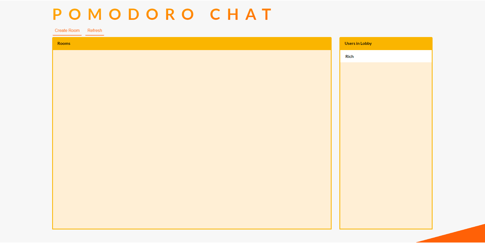

# pomodoro-chat
A peer-to-peer video chat application for studying using the pomodoro technique

<https://pomodoro-chat.herokuapp.com/>

# Built With
* [Webrtc](https://webrtc.org/) - Real-Time Communications API used for peer connections and streaming
* [Socket.io](https://socket.io/) - Signaling server

# Todo
* Update sass to support moblie with media queries
* Refactor and concat javacript files
* Rework file structure 

# Acknowledgments
This applicaiton uses these sounds from freesound:

320655\__rhodesmas__level-up-01.mp3 by shinephoenixstormcrow (<https://freesound.org/s/337049/>)

Analog Alarm Clock by bone666138 (<https://freesound.org/s/198841/>)

